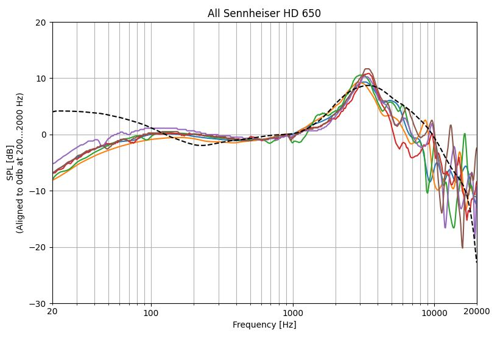

# FreqRespGraph

FreqRespGraph is a simple tool to plot and compare frequency response measurement data from CSV files. It is written in [Python 3](https://www.python.org/) using [matplotlib](https://matplotlib.org/), [numpy](https://numpy.org/) and [scipy](https://scipy.org/).

# Installation
1. Download and install Python 3.X on your system: [https://www.python.org/downloads/](https://www.python.org/downloads/)
1. Open a shell / command prompt and install matplotlib, numphy and scipy: `pip install matplotlib` `pip install numpy` `pip install scipy`
1. Optionally install git command line client: [https://github.com/git-guides/install-git](https://github.com/git-guides/install-git)
1. Download FreqRespGraph:
   - Clone git repository: `git clone https://github.com/rwhomeaudio/FreqRespGraph` or
   - Download ZIP archive from [https://github.com/rwhomeaudio/FreqRespGraph](https://github.com/rwhomeaudio/FreqRespGraph) using "Code->Download ZIP" button.
1. Test the installation by running: `python FreqRespGraph.py -h`
# Usage
```
python FreqRespGraph.py -h
usage: FreqRespGraph [-h] [--ymin [YMIN]] [--ymax [YMAX]] [--xmin [XMIN]] [--xmax [XMAX]] [--alignmin [ALIGNMIN]]
                     [--alignmax [ALIGNMAX]] [--hidealignment] [--refcurve [REFCURVE]] [--nolegend] [--compensate] [--title [TITLE]]
                     [--peq [PEQ ...]] [--fpeq [FPEQ]] [--hidepeq] [--smooth [SMOOTH]] [--smoothonly] [--csvdelimiter [CSVDELIMITER]]
                     --files [FILES ...]

FreqRespGraph can plot single or multiple frequency response graphs given as CSV data files in a single graph. X and Y Axis
limit can be configured. Data can be aligned to 0dB at a given frequency or frequency range. In addition a reference curve
can be specified. Filter settings for a parametric equalizer can be specified to additionally plot the equalizer response 
and curve(s) equalized by it. Curves can be smoothed by a given fraction of an octave using a Savitzky-Golay filter with
second order polynom. The CSV data files needs to contain 2 rows with frequency and SPL.

options:
  -h, --help            show this help message and exit
  --ymin [YMIN]         Y-Axis minumum, default -30db
  --ymax [YMAX]         Y-Axis maximum, default 20db
  --xmin [XMIN]         X-Axis minumum, default 20Hz
  --xmax [XMAX]         X-Axis maximum, default 20000Hz
  --alignmin [ALIGNMIN]
                        Align Y-Axis at given frequency to 0 dB, default off
  --alignmax [ALIGNMAX]
                        Align Y-Axis at frequency range to 0 dB, default off
  --hidealignment       Do not show aligment arguments in Y-Axis label, default off
  --refcurve [REFCURVE]
                        Plot given CSV file as dotted reference curve, default off
  --nolegend            Do not show curves legend, default off
  --compensate          Compensate according to given reference curve, default off
  --title [TITLE]       Set graph title, default off
  --peq [PEQ ...]       Apply given PEQ settings, format for each filter is PEAK|LOWSHELF|HIGHSHELF|LOWPASS|HIGHPASS|BANDPASS|NOTCH,<Freq>,<Q>,<Gain>, default none
  --fpeq [FPEQ]         Sampling frequency used to simulate PEQ, default 48000
  --hidepeq             Hide equalizer curve
  --smooth [SMOOTH]     Smooth curves according to given fraction of an octave, e.g. 1/12, 0.5 or 1, default off
  --smoothonly          Only show smoothed curves
  --csvdelimiter [CSVDELIMITER]
                        Delimiter character used in CSV files, default ","
  --files [FILES ...]   CSV filenames to be plotted (supports filename wildcards)
  ```
# Examples
The following examples use the headphone measurment and target curves provided by [AutoEq](https://github.com/jaakkopasanen/AutoEq).

1. Show all RTings measurements of Sennheiser over ear headphones (already alighned to 1kHz): `python FreqRespGraph\FreqRespGraph.py --files AutoEq\measurements\Rtings\data\over-ear\Sennheiser*.csv`
   
3. Show all RTings measurements of Sennheiser over ear headphones aligned to 440Hz): `python FreqRespGraph\FreqRespGraph.py --alignmin 440 --files AutoEq\measurements\Rtings\data\over-ear\Sennheiser*.csv`
 
5. Since aligning to a single frequency is misleading align to frequency range instead and additionally plot harman target curve: `python FreqRespGraph\FreqRespGraph.py --alignmin 200 --alignmax 2000 --title "All Rtings Sennheiser measurements" --refcurve "AutoEq\targets\Harman over-ear 2018.csv" --title "All Rtings Sennheiser measurements" --files AutoEq\measurements\Rtings\data\over-ear\Sennheiser*.csv`
 
7. All Rtings measurments without legend: `python FreqRespGraph\FreqRespGraph.py --alignmin 200 --alignmax 2000 --title "All Rtings Sennheiser measurements" --refcurve "AutoEq\targets\Harman over-ear 2018.csv" --nolegend --title "All Rtings measurements" --files AutoEq\measurements\Rtings\data\over-ear\*.csv`
 
9. All Sennheiser HD 650 measurements: `python FreqRespGraph\FreqRespGraph.py --alignmin 200 --alignmax 2000 --refcurve "AutoEq\targets\Harman over-ear 2018.csv" --nolegend --title "All Sennheiser HD 650" --files "AutoEq\measurements\oratory1990\data\over-ear\Sennheiser HD 650.csv" "AutoEq\measurements\Rtings\data\over-ear\Sennheiser HD 650.csv" "AutoEq\measurements\Kuulokenurkka\data\over-ear\Sennheiser HD 650.csv" "AutoEq\measurements\Innerfidelity\data\over-ear\Sennheiser HD 650.csv" "AutoEq\measurements\Headphone.com Legacy\data\over-ear\Sennheiser HD 650.csv" "AutoEq\measurements\Headphone.com Legacy\data\over-ear\Sennheiser HD 650 (balanced).csv"`

11. All Sennheiser HD 650 measurements compensated to harman reference curve: `python FreqRespGraph\FreqRespGraph.py --alignmin 200 --alignmax 2000 --title "All Rtings Sennheiser measurements" --refcurve "AutoEq\targets\Harman over-ear 2018.csv" --compensate --nolegend --title "All Sennheiser HD 650 compensated" --files "AutoEq\measurements\*\*\*\Sennheiser HD 650.csv"`

13. Grado GS1000 equalized by PEQ filters: `python FreqRespGraph\FreqRespGraph.py --alignmin 200 --alignmax 2000 --refcurve "AutoEq\targets\Harman over-ear 2018.csv" --title "Equalizing Grado GS1000" --files "AutoEq\measurements\Innerfidelity\data\over-ear\Grado GS1000.csv" --peq LOWSHELF,40,1,6 PEAK,83,1.1,-3 PEAK,4380,2.0,-3.4 PEAK,6400,2.0,-5.3 PEAK,11200,2.0,-8`

14. Loudspeaker frequency response exported by REW with smoothed curve: `python FreqRespGraph\FreqRespGraph.py --csvdelimiter " " --ymin=0 --ymax=90 --smooth 1/1 --title "Smoothed REW measurement" --files REW_raw.txt`


# Tips
1. Often the legend on the right side doesn't fit in the plot. You can just disable it using `--nolegend` or adjust the size by using the "right" slider in "Configure subplots" menu. You can click on the legend and drag it to some other location.
2. You can click on the line symbol of a legend entry. This first click will highlight the corresponding curve, the second will hide the curve and the third click switches it back to the default.
3. Complex wildcard file patterns could be used. It is implemented using [glob](https://docs.python.org/3/library/glob.html). E.g. something like `--files AutoEq\measurements\*\*\*\Sennheiser*.csv` can be used.
4. Compensation according to reference curve is faster if reference curve and data curve contain the exact same frequencies. Otherwise interpolation of the reference curve data is used to compensate the data curves. In this case data which is not within the frequency range of the reference curve will not be displayed.
5. PEQ shelf filter ignore the Q setting, shelf filters use a fixed Q=1/SQRT(2).
6. Smoothing uses a Savitzky-Golay filter of given octave fraction length with 1th order polynomial. The algorithm is very different to e.g. the one used by [REW](https://www.roomeqwizard.com/help/help_en-GB/html/graph.html#top). Results are very similar but not identical to REW.
  
# References
1. Jaakko Pasanen, AutoEq, https://github.com/jaakkopasanen/AutoEq, https://autoeq.app/
2. Paul Lutus, BiQuadDesigner, https://arachnoid.com/BiQuadDesigner/index.html
3. Robert Bristow-Johnson, Cookbook formulae for audio equalizer biquad filter coefficients, https://webaudio.github.io/Audio-EQ-Cookbook/audio-eq-cookbook.html
4. Savitzky-Golay filter, https://en.wikipedia.org/wiki/Savitzky%E2%80%93Golay_filter
